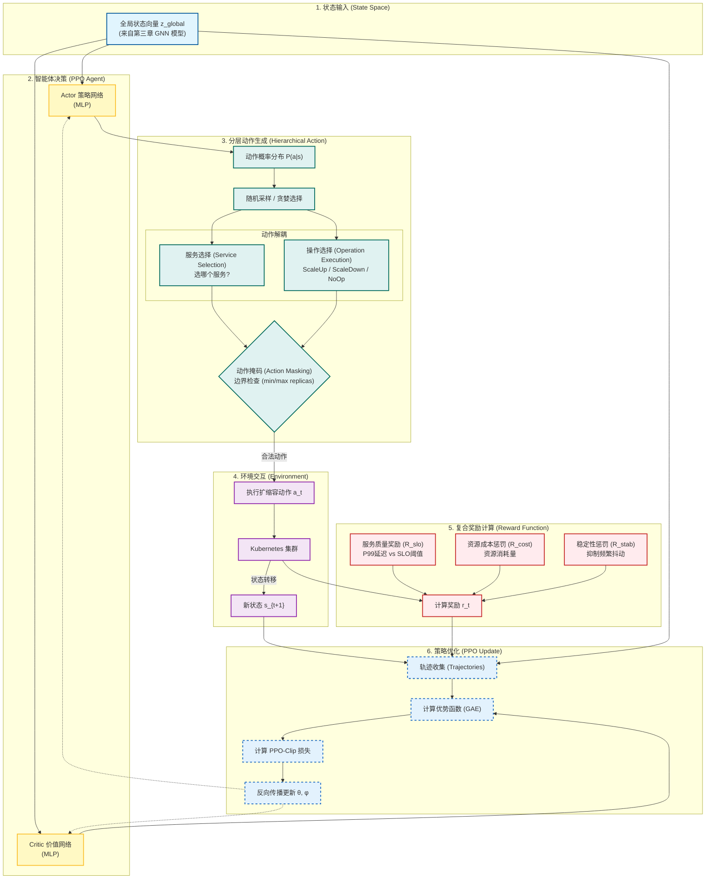

# test

```mermaid
graph TD
    %% 定义样式
    classDef input fill:#e1f5fe,stroke:#01579b,stroke-width:2px;
    classDef agent fill:#fff9c4,stroke:#fbc02d,stroke-width:2px;
    classDef action fill:#e0f2f1,stroke:#00695c,stroke-width:2px;
    classDef env fill:#f3e5f5,stroke:#8e24aa,stroke-width:2px;
    classDef reward fill:#ffebee,stroke:#c62828,stroke-width:2px;
    classDef algo fill:#e3f2fd,stroke:#1565c0,stroke-width:2px,stroke-dasharray: 5 5;

    subgraph "1. 状态输入 (State Space)"
        Z_global["全局状态向量 z_global<br>(来自第三章 GNN 模型)"]:::input
    end

    subgraph "2. 智能体决策 (PPO Agent)"
        Actor["Actor 策略网络<br>(MLP)"]:::agent
        Critic["Critic 价值网络<br>(MLP)"]:::agent
        
        Z_global --> Actor
        Z_global --> Critic
    end

    subgraph "3. 分层动作生成 (Hierarchical Action)"
        Logits["动作概率分布 P(a|s)"]:::action
        Sampling["随机采样 / 贪婪选择"]:::action
        
        Actor --> Logits --> Sampling
        
        subgraph "动作解耦"
            Service_Sel["服务选择 (Service Selection)<br>选哪个服务?"]:::action
            Op_Sel["操作选择 (Operation Execution)<br>ScaleUp / ScaleDown / NoOp"]:::action
        end
        
        Sampling --> Service_Sel
        Sampling --> Op_Sel
        
        Action_Masking{"动作掩码 (Action Masking)<br>边界检查 (min/max replicas)"}:::action
        Service_Sel --> Action_Masking
        Op_Sel --> Action_Masking
    end

    subgraph "4. 环境交互 (Environment)"
        Exec["执行扩缩容动作 a_t"]:::env
        K8s["Kubernetes 集群"]:::env
        NewState["新状态 s_{t+1}"]:::env
        
        Action_Masking --"合法动作"--> Exec
        Exec --> K8s
        K8s --"状态转移"--> NewState
    end

    subgraph "5. 复合奖励计算 (Reward Function)"
        R_calc["计算奖励 r_t"]:::reward
        R_SLO["服务质量奖励 (R_slo)<br>P99延迟 vs SLO阈值"]:::reward
        R_Cost["资源成本惩罚 (R_cost)<br>资源消耗量"]:::reward
        R_Stab["稳定性惩罚 (R_stab)<br>抑制频繁抖动"]:::reward
        
        K8s --> R_calc
        R_SLO --> R_calc
        R_Cost --> R_calc
        R_Stab --> R_calc
    end

    subgraph "6. 策略优化 (PPO Update)"
        Buffer["轨迹收集 (Trajectories)"]:::algo
        Advantage["计算优势函数 (GAE)"]:::algo
        Loss["计算 PPO-Clip 损失"]:::algo
        Update["反向传播更新 θ, φ"]:::algo
        
        NewState --> Buffer
        R_calc --> Buffer
        Critic --> Advantage
        Buffer --> Advantage
        Advantage --> Loss
        Loss --> Update
        Update -.-> Actor
        Update -.-> Critic
    end

    %% 连接关系
    Z_global --> Buffer
```
